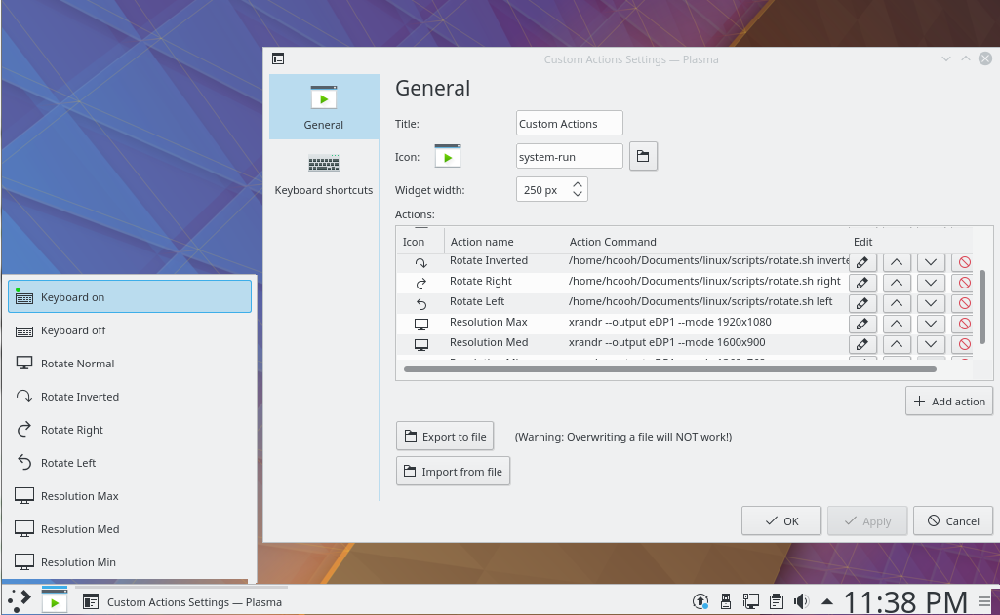

# plasmoid-custom-actions

Plasma 5 custom actions plasmoid.
A "launcher" for your own commands!

It can also export and re-import the created custom actions



## Installation


### Dependencies:
* plasma-framework-devel

### From source with cmake

```
git clone https://github.com/hcoohb/plasmoid-custom-actions
cd plasmoid-custom-actions
mkdir build
cd build
cmake -DCMAKE_INSTALL_PREFIX=/usr ..
make
sudo make install
```
then add the plasmoid "Custom actions"

### From source with plasmapkg2

```
git clone https://github.com/hcoohb/plasmoid-custom-actions
cd plasmoid-custom-actions
plasmapkg2 -i package
```
then add the plasmoid "Custom actions"
